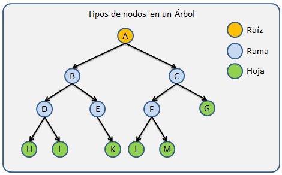
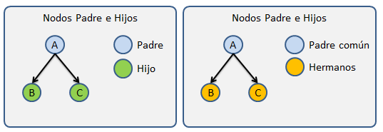
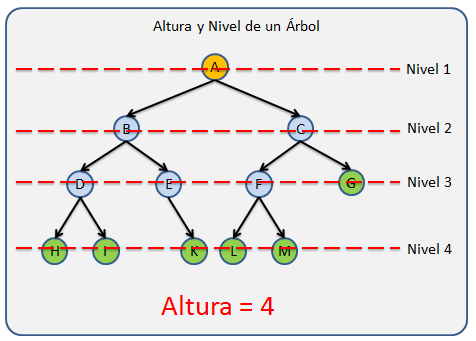
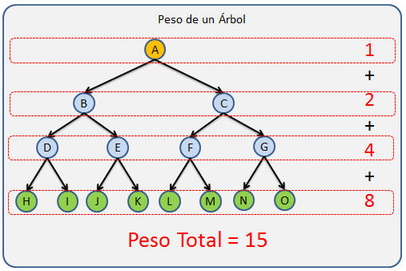
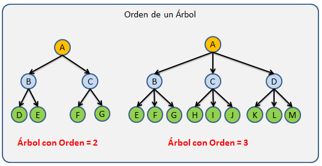
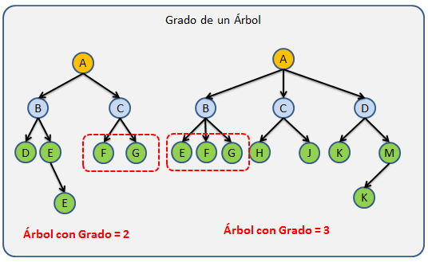
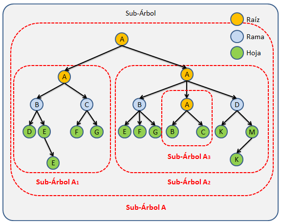

# 🌲 árboles 🌲
Un árbol es una estructura de datos no lineal compuesta por un conjunto de nodos (o vértices) conectados mediante aristas (o arcos) que satisface estas propiedades fundamentales:

_Existe un nodo especial denominado raíz que no tiene padre_. Cada nodo distinto de la raíz está conectado exactamente a un nodo padre mediante una arista. Existe un camino único desde la raíz hasta cualquier otro nodo del árbol. Esta última propiedad es la que distingue un árbol de un grafo general: en un árbol no hay ciclos.

A diferencia de una lista enlazada, donde cada elemento tiene como máximo un sucesor, un nodo de un árbol puede tener múltiples sucesores (hijos). Esta capacidad de ramificación es lo que convierte al árbol en una estructura tan potente para representar relaciones jerárquicas.

- En Java, los árboles se implementan mediante clases donde cada objeto (nodo) contiene una referencia a sus nodos hijos. La naturaleza recursiva de los árboles hace que tanto su definición como la mayoría de sus algoritmos se expresen de forma natural mediante recursividad.

---
💡 _**Analogía práctica (Más bien friki):** Piensa en el sistema de archivos de tu ordenador. El directorio raíz (/ en Linux o C:\ en Windows) es el nodo raíz. Cada carpeta es un nodo interno que puede contener más carpetas (hijos) y archivos (hojas). No puedes llegar a un archivo por dos rutas diferentes dentro de la misma estructura, exactamente como en un árbol._

## Datos importantes de los arboles

Para comprender mejor que es un árbol comenzaremos explicando como está estructurado.

| Nodos | "Se le llama Nodo a cada elemento que contiene un Árbol."|
|-|-|
| Nodo Raíz | "Se refiere al primer nodo de un Árbol, Solo un nodo del Árbol puede ser la Raíz."|
| Nodo Padre | "Se utiliza este termino para llamar a todos aquellos nodos que tiene al menos un hijo."|
| Nodo Hijo | "Los hijos son todos aquellos nodos que tiene un padre."|
|Nodo Hermano | "Los nodos hermanos son aquellos nodos que comparte a un mismo padre en común dentro de la estructura."|
|Nodo Hoja| "Son todos aquellos nodos que no tienen hijos, los cuales siempre se encuentran en los extremos de la estructura."|
|Nodo Rama| Estos son todos aquellos nodos que no son la raíz  y que ademas tiene al menos un hijo.|
|

Los árboles a demas de los nodos tiene otras propiedades importantes que son utilizadas en diferente ámbitos los cuales son:

# 
### Nivel:
 Nos referimos como nivel a cada generación dentro del árbol. 
 Por ejemplo, cuando a un nodo hoja le agregamos un hijo, el nodo hoja pasa a ser un nodo rama pero a demas el árbol crece una generación por lo que el Árbol tiene un nivel mas.Cada generación tiene un número de Nivel distinto que las demas generaciones.

- Un árbol vacío tiene 0 niveles

- El nivel de la Raíz es 1

- El nivel de cada nodo se calcula contando cuantos nodos existen sobre él, hasta llegar a la raíz + 1, y de forma inversa también se podría, contar cuantos nodos existes desde la raíz hasta el nodo buscado + 1.
# 

### Altura:
 Le llamamos Altura al número máximo de niveles de un Árbol.

La altura es calculado mediante recursividad tomando el nivel mas grande de los dos sub-árboles de forma recursiva de la siguiente manera:

- **altura** = max(altura(hijo1), altura(hijo2),altura(hijoN)) + 1
#
 

### Peso: 
Conocemos como peso a el número de nodos que tiene un Árbol. Este factor es importante por que nos da una idea del tamaño del árbol y el tamaño en memoria que nos puede ocupar en tiempo de ejecución(Complejidad Espacial en análisis de algoritmos.)

El peso se puede calcular mediante cualquier tipo de recorrido el cual valla contando los nodo a medida que avanza sobre la estructura. El peso es un árbol es igual a la suma del peso de los sub-árboles hijos + 1

- **peso** = peso(hijo1) + peso(hijo2) + peso(hijoN)+ 1
# 

### Orden: 
El Orden de un árbol es el número máximo de hijos que puede tener un Nodo.

Notemos que un Árbol con Orden = 1 no tendría sentido ya que seria una estructura lineal. ya que cada nodo solo podría tener un Hijo y tendríamos un Árbol como la Imagen de la Fig.1.

Este valor no lo calculamos, si no que ya lo debemos conocer cuando diseñamos nuestra estructura, ya que si queremos calcular esto lo que obtendremos es el grado.
# 

### Grado: 
El grado se refiere al número mayor de hijos que tiene alguno de los nodos del Árbol y esta limitado por el Orden, ya que este indica el número máximo de hijos que puede tener un nodo.
El grado se calcula contando de forma recursiva el número de hijos de cada sub-árbol hijo y el numero de hijos del nodo actual para tomar el mayor, esta operación se hace de forma recursiva para recorrer todo el árbol.

- **Grado** = max(contarHijos(hijo1),contarHijos(hijo2), contarHijos(hijoN), contarHijos(this))
#

### Sub-Árbol: 
Conocemos como Sub-Árbol a todo Árbol generado a partir de una sección determinada del Árbol, Por lo que podemos decir que un Árbol es un nodo Raíz con N Sub-Árboles.

##

# Links de interés: 

- Página de la que saque la mayor cantidad de información: 
[ECHALE UN VISTAZO](https://www.oscarblancarteblog.com/2014/08/22/estructura-de-datos-arboles/)