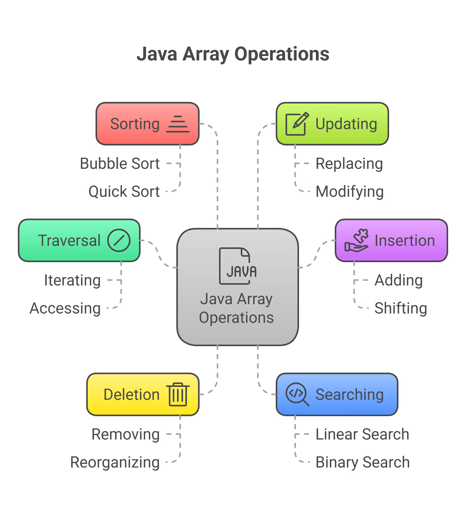

# Arrays / Arreglos

Los arrays, o arreglos, son colecciones de elementos del mismo tipo, accesibles a través de un índice. Son estáticos en tamaño, lo que significa que su tamaño no puede cambiar después de la creación.

Ofrecen una forma sencilla pero potente de gestionar datos de manera eficiente, lo que los convierte en un concepto clave en la programación Java. Java proporciona diversos tipos para adaptarse a diferentes necesidades, desde arrays unidimensionales hasta multidimensionales.

- Se trabaja con una única colección estructurada en lugar de con variables dispersas.

- El array almacena valores en ubicaciones de memoria contiguas, lo que permite un acceso rápido.

- Cada elemento se identifica mediante un índice que comienza en 0, lo que simplifica la recuperación y las actualizaciones.

- Los arrays son ideales cuando se conoce el número de elementos y se necesita un acceso o una iteración eficientes.

- Son útiles para almacenar conjuntos de datos, procesar listas o gestionar operaciones repetitivas.

## Propiedades de los arrays en Java

- **Tamaño fijo:** Una vez creado, el tamaño de un array no se puede cambiar.
- **Elementos indexados:** Los elementos se almacenan en ubicaciones de memoria contiguas y se accede a ellos mediante índices basados ​​en cero.
- **Datos homogéneos:** Todos los elementos deben ser del mismo tipo de datos.
- **Valores predeterminados:** Los elementos tienen valores predeterminados si no se les asignan explícitamente ( 0 para tipos numéricos,  falso para booleanos,  nulo para objetos).
- **Propiedad Length:** Los arrays tienen una propiedad length incorporada  que almacena su tamaño ( array.length ).
- **Tipo de referencia:** En Java, los arrays son objetos, por lo que la variable contiene una referencia al array.

## Operaciones básicas con arrays en Java

# 
## SINTAXIS EN JAVA 
### Arreglos Unidimensionales

    Tipo_de_Variable[] Nombre_de_Array = new Tipo_de_Variable [tamaño];

Ejemplo:
- int[ ] edad = new int[4];

- string [ ] nombre = new string [2];

- int [] numeros ={ 5,6,7};