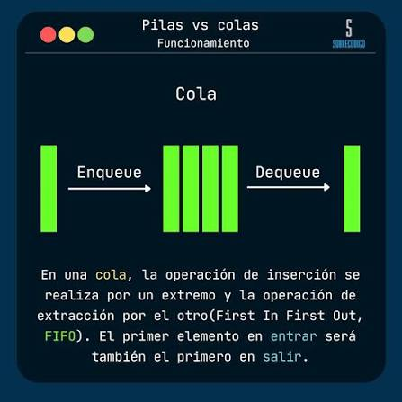
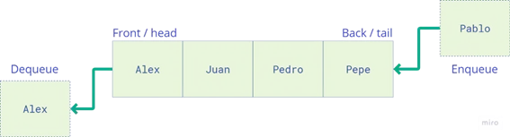

# Cola
Una cola (queue en inglés) es una estructura de datos lineal que sigue el principio FIFO (First In, First Out): el primer elemento que se inserta es el primero en ser extraído. Es, junto con la pila y la lista enlazada, una de las estructuras fundamentales de la informática y una de las más utilizadas en la práctica profesional.

La analogía más intuitiva es una fila de personas esperando en un banco o en un supermercado: la primera persona que llega es la primera en ser atendida, y las nuevas personas se incorporan al final de la fila. Esta metáfora captura perfectamente el comportamiento de una cola: los elementos se insertan por un extremo (el final o rear) y se extraen por el otro (el frente o front).

>💡**_FIFO vs LIFO: Mientras que una cola sigue el principio FIFO (el primero en entrar es el primero en salir), una pila sigue el principio LIFO (Last In, First Out — el último en entrar es el primero en salir). Ambas son restricciones del tipo abstracto lista, pero con reglas de acceso distintas._**

## Metodos más usados

|**`add`:**| inserta un elemento en la cola.|
|--|--|
|**`poll`:**| elimina y devuelve el primer elemento de la cola.|
|  **`peek`:**| devuelve el primer elemento de la cola sin eliminarlo.|
|**`isEmpty`:** |verifica si la cola está vacía.(true si la cola no tiene elementos)|
|**`enqueue(e)`:**| Inserta el elemento e al final de la cola|
|**`dequeue()`:**| Extrae y devuelve el elemento del frente
|**`front()`:**| Devuelve el elemento del frente sin extraerlo|
|**`size()`:**| Devuelve el número de elementos en la cola|

## Cola estática vs. cola dinámica
### Cola estática

Se implementa con un arreglo (array) de tamaño fijo.

**Características:**

- Necesita dos índices: uno para el frente (frente) y otro para el final (final), que marcan por dónde se saca y por dónde se inserta.

- El tamaño máximo queda definido desde el inicio y no cambia.
- Si el arreglo se llena → overflow.
- Un problema típico es que, si se implementa de forma lineal simple, al eliminar elementos por el frente se "desperdician" posiciones al inicio del arreglo que no se pueden reutilizar — por eso normalmente se implementa como cola circular, donde el índice vuelve al inicio del arreglo cuando llega al final.

### Cola dinámica

Se implementa con nodos enlazados, igual que tu Nodo.

**Características:**

- Se necesitan dos referencias: una al primer nodo (frente de la cola) y otra al último nodo (final de la cola), para que insertar al final sea eficiente (sin recorrer toda la lista).
- No tiene límite fijo: crece y se reduce según la memoria disponible.
- No hay overflow por capacidad, ni desperdicio de espacio como en la versión estática lineal.
Un poco más de costo por nodo (referencia extra), pero más flexible.

	

