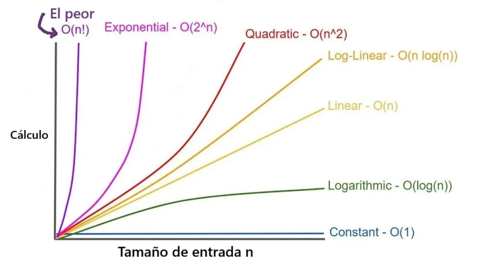

# ¿Qué es la complejidad Algoritmica?

Gráfico representativo de cada tipo de complejidad algorítmica existente

La complejidad algorítmica es una manera de comprender “cuánto tiempo o esfuerzo necesita un algoritmo para hacer su trabajo.” 
**Pongamos un ejemplo:** si tengo que organizar mis zapatos, ¿me toma 1 minuto o 1 hora? Saber esto nos ayuda a elegir las mejores soluciones cuando programamos.

## ⭐Big O
Big O es como decir: _“este método es rápido incluso con muchos datos” o “este método se vuelve lento muy rápidamente”._

Es solo una manera de escribir qué tan rápido o lento crece el tiempo que tarda un algoritmo según la cantidad de datos que tiene que manejar. Para ejemplificarlo podríamos decir que: Buscar una palabra en un libro con mil página, no es lo mismo que buscar en el índice (esto puede considerarse rápido), antes que leer página por página (lento).

### Tipos de Notación Big O

- **O(1) — Tiempo constante**: Siempre tarda lo mismo.

O(1) puede representarse como un algoritmo que siempre tarda la misma cantidad de tiempo de ejecución de un programa.

- **O(log n) — Tiempo logarítimico**: El algoritmo divide el problema a la mitad en cada paso.

- **O(n) — Tiempo lineal**: El tiempo que tarda el algoritmo crece al mismo ritmo que la cantidad de datos. Si tienes el doble de datos, toma el doble de tiempo.

- **O(n log n) — Tiempo linearítmico**: Es una combinación de O(n) y O(log n). 
Divide los datos en partes mas pequeñas, ordena cada parte y las combina de forma eficiente. 

- **O(n²) — Tiempo cuadrático**: ocurre cuando un algoritmo necesita comparar o procesar cada elemento con todos los demás, usando un bucle dentro de otro. El tiempo de ejecución crece muy rápido: si duplicas la cantidad de datos, el trabajo puede multiplicarse por cuatro. En otras palabras el algoritmo tiene que hacer una tarea dentro de otra. Se llama “cuadrático” porque el tiempo crece como “n por n” (n²).

- **O(2ⁿ) — Tiempo exponencial**: el tiempo de ejecución de el algoritmo se duplica con cada elemento adicional que agregamos a los datos de entrada.
_"Si hay 1 elemento, hace 2 cosas. Si hay 2 elementos, hace 4. Con 3 elementos, hace 8… Así hasta que, con solo 20 elementos, puede tener que hacer más de un millón de operaciones"._ Este tipo de complejidad aparece cuando el algoritmo tiene que probar todas las combinaciones posibles.

- **O(n!) — Tiempo factorial**:Este tipo de algoritmo explora todas las combinaciones posibles para resolver un problema. Eso significa que cuantas más opciones haya, más explosivamente crece el tiempo necesario para revisarlas todas.

## [¡mismas explicaciones pero mas detalladamente!](https://medium.com/@ermarly/cómo-entender-la-complejidad-algorítmica-o-1-o-n-o-n²-y-más-explicada-con-cosas-cotidianas-478a97757044)

### Links de interés: 
[Complejidad Algorítmica sin llorar - Notación Big O
-Youtube](https://youtu.be/UPDjjuz1Hkw?si=ncK9lrSaGq9eWolP)

