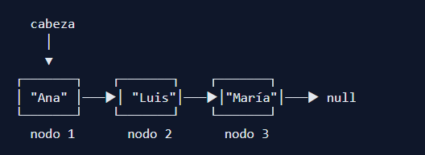
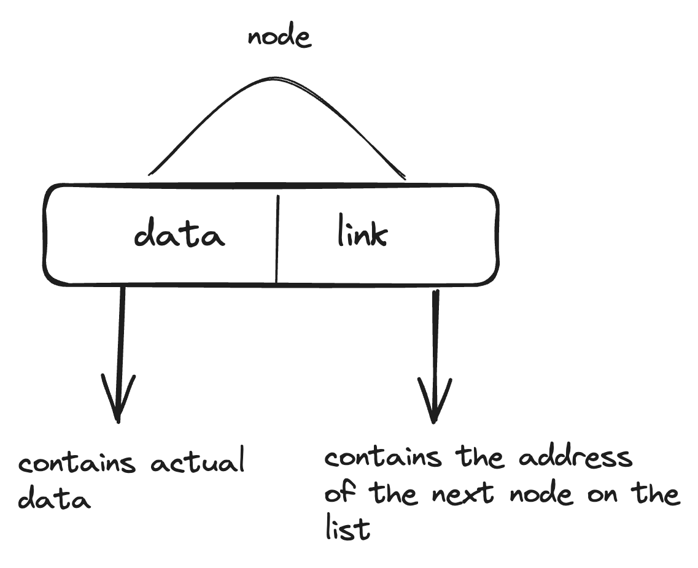
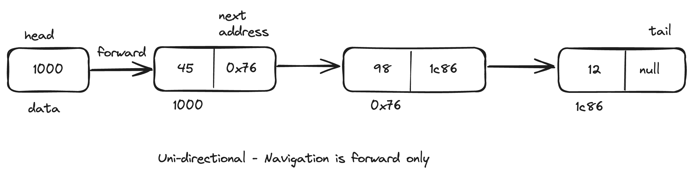
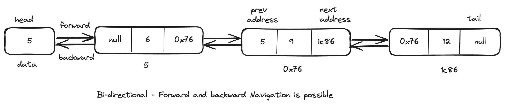
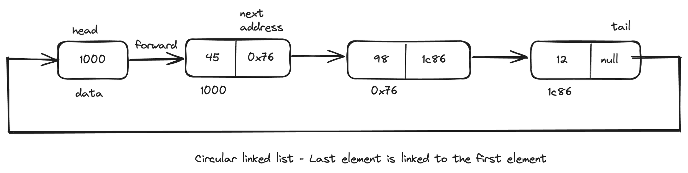
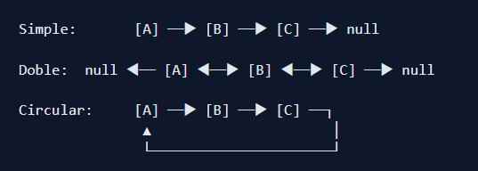

# Lista Enlazada

Una lista enlazada (linked list) es una estructura de datos lineal formada por una secuencia de elementos —denominados nodos— en la que cada nodo contiene un dato y una referencia (o puntero) al siguiente nodo de la secuencia. A diferencia de los arrays, los elementos de una lista enlazada no se almacenan en posiciones contiguas de memoria, lo que proporciona una flexibilidad extraordinaria para insertar y eliminar elementos sin necesidad de desplazar los restantes.

- cabeza => Apunta a la primera casilla de la lista
- cola => Apunta a la última casilla de la lista

💡 _**Concepto clave:** Cada nodo de una lista enlazada conoce únicamente a su vecino inmediato. Para acceder al tercer elemento, es necesario pasar primero por el primero y el segundo. Esta es la diferencia fundamental con un array, donde se accede a cualquier posición directamente mediante su índice._

## ¿Qué es un nodo?
El nodo es el bloque de construcción básico de toda lista enlazada. Cada nodo almacena dos elementos: el dato (la información útil) y una referencia al siguiente nodo.
 Esta referencia, a menudo denominada "puntero", facilita la creación de una estructura en cadena, donde los nodos se interconectan formando la lista enlazada.

La naturaleza autorreferencial de los nodos permite un recorrido y manipulación eficientes de los datos dentro de la lista enlazada. La estructura se puede implementar utilizando clases o arreglos. 

## Tipo de listas enlazadas

Existen tres variantes principales de listas enlazadas, cada una con características y casos de uso específicos:

#
## Lista enlazada simple

### Características de rendimiento de las listas enlazadas simples

- **Recorrido:** El recorrido solo está permitido en una dirección (es decir, solo hacia adelante). Puedes avanzar por la lista, pero no puedes retroceder fácilmente.
- **Eficiencia de memoria:** Las listas enlazadas simples suelen ser más eficientes en cuanto al uso de memoria, ya que solo requieren una referencia por nodo.

- **Complejidad:** La operación de inserción y eliminación es más sencilla, ya que solo es necesario actualizar las referencias en una dirección.

#
## Lista doblemente enlazada
En una lista doblemente enlazada, el headnodo normalmente no tiene una prevreferencia porque es el primer nodo y, por lo tanto, no tiene un nodo anterior.

Sin embargo, el headnodo sí tiene una nextreferencia que apunta al siguiente nodo de la lista. Cada nodo contiene datos y referencias tanto al nodo siguiente como al anterior.

### Características de rendimiento de las listas doblemente enlazadas

- **Recorrido:** Las listas doblemente enlazadas permiten recorrerlas en ambas direcciones: hacia adelante y hacia atrás. Este recorrido bidireccional posibilita una navegación más flexible a través de la lista, permitiendo operaciones como la iteración en orden inverso.

- **Eficiencia de memoria :** Las listas doblemente enlazadas suelen requerir más memoria que las listas enlazadas simples, ya que cada nodo contiene dos referencias (punteros): una para el nodo siguiente y otra para el nodo anterior. Este consumo adicional de memoria por nodo puede afectar la eficiencia general de la memoria, especialmente en listas grandes.

- **Complejidad :** Las listas doblemente enlazadas ofrecen recorrido bidireccional y flexibilidad. Las operaciones de inserción y eliminación pueden requerir la actualización de referencias en ambas direcciones (hacia adelante y hacia atrás), lo que puede aumentar la complejidad y afectar potencialmente el rendimiento.

## Lista enlazada circular

Una lista enlazada circular es un tipo de lista enlazada donde el último nodo apunta al primero, formando un círculo o bucle. Esta característica la distingue de una lista enlazada tradicional, donde el último nodo suele apuntar a null, indicando el final de la lista. En una lista enlazada circular, no hay un puntero nulo al final; en cambio, el último nodo apunta al primero, creando una estructura de bucle. Este comportamiento de bucle permite recorrer la lista de forma continua. La siguiente imagen muestra cómo funciona una lista enlazada circular simple.

### Características de rendimiento de las listas enlazadas circulares
- **Recorrido:** Las listas enlazadas circulares permiten recorrerlas en bucle, facilitando una navegación fluida entre nodos independientemente de la dirección. Esta estructura circular permite un recorrido eficiente sin necesidad de volver al principio al llegar al final, lo que mejora el rendimiento.
- **Eficiencia de memoria :** Las listas enlazadas circulares simples suelen ofrecer una eficiencia de memoria similar a la de las listas enlazadas simples, ya que solo requieren un puntero por nodo para conectarse al siguiente nodo de la secuencia. Esta estructura de un solo puntero reduce la sobrecarga de memoria por nodo en comparación con las listas enlazadas dobles, lo que puede mejorar la eficiencia de memoria para listas grandes.
- **Complejidad:** En las listas enlazadas circulares simples, las operaciones de inserción y eliminación requieren actualizar las referencias para mantener la estructura circular, lo que introduce una complejidad moderada en comparación con las listas enlazadas lineales.

## Diferencias de cada lista

#

# Diferencias entre un array y una lista enlazada
Una lista enlazada es una forma dinámica de representar una lista, donde agregar o eliminar elementos desde el principio generalmente implica modificar solo unos pocos punteros. Esta operación se puede realizar en tiempo constante, denotado como O(1), independientemente del tamaño de la lista.

Por otro lado, los arreglos son una representación secuencial de una lista. Agregar o eliminar elementos del principio de la lista requiere desplazar todos los elementos subsiguientes para acomodar el cambio. Esta operación tiene una complejidad temporal de O(n), donde n es el número de elementos del arreglo. Por lo tanto, para arreglos grandes, agregar o eliminar elementos del principio puede ser relativamente lento en comparación con las listas enlazadas.
### ¿Cuando conviene usar una lista en vez de un arreglo?
 LinkedList es preferible cuando las operaciones más frecuentes son inserciones y eliminaciones en los extremos o en posiciones intermedias ya localizadas, especialmente con grandes volúmenes de datos. ArrayList es mejor para acceso aleatorio por índice y cuando el tamaño de la colección no cambia frecuentemente. En la práctica, ArrayList suele ser más rápido en la mayoría de escenarios gracias a la localidad de caché de memoria. 
# 
# Links de interés 

- Dónde saque la mayor cantidad de información: [FREECODECAMP](https://www-freecodecamp-org.translate.goog/news/what-is-a-linked-list-types-and-examples/?_x_tr_sl=en&_x_tr_tl=es&_x_tr_hl=es&_x_tr_pto=tc)