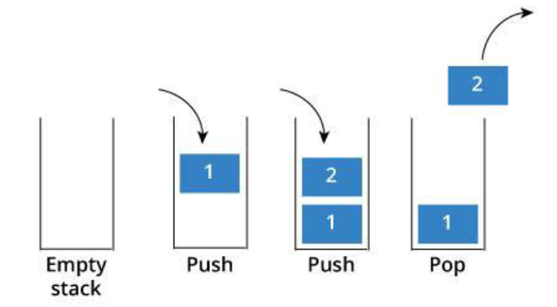

# Pila
Una pila es una secuencia de elementos del mismo tipo en la que el acceso se realiza por un único extremo denominado cima (top). Imagina una pila de libros: solo puedes colocar un libro nuevo encima de la pila o retirar el que está en la parte superior. Los libros del fondo no son directamente accesibles sin retirar primero los que están encima.

Este comportamiento se denomina LIFO (Last In, First Out): el último elemento insertado es siempre el primero en ser extraído. Es lo opuesto a una cola, que funciona con FIFO (First In, First Out).

La pila se utiliza en muchas aplicaciones, por ejemplo, en los editores de texto. Todos los cambios se almacenan en una pila. Al deshacer una acción, se muestra la acción más reciente. Al realizar cambios, estos se añaden a la pila.

Seguramente también habrás observado los botones de retroceso y avance en los navegadores . Estas operaciones también se realizan mediante pilas.
# 
## Operaciones fundamentales

- **`push`:** inserta un elemento superior de la pila.
-  **`pop`:** elimina el elemento superior de la pila.
- **`peek`:** devuelve el elemento superior de la pila sin eliminarlo.
- **`isEmpty`:** verifica si la pila está vacía. (Devuelve true si la pila no contiene elementos)
- **`search`:** busca un elemento en la pila y devuelve su distancia desde la parte superior.
- **`size()`**: Devuelve el número de elementos en la pila.

## Análisis del funcionamiento

#
## Pila estática vs. pila dinámica

### Pila estática

Se implementa generalmente con un arreglo (array) de tamaño fijo, definido al momento de crear la estructura.

**Características:**

- El tamaño máximo se define de antemano y no puede cambiar en tiempo de ejecución.
- Usa un índice (por ejemplo tope o cima) para saber cuál es la posición del último elemento insertado.
- Si intentas insertar más elementos de los que caben en el arreglo → overflow (desbordamiento).
- Acceso más rápido y uso de memoria más predecible, porque todo está reservado de forma contigua.

### Pila dinámica

Se implementa generalmente con nodos enlazados (como el Nodo que ya tienes en tu código), donde cada nodo apunta al siguiente.

Características:

- No tiene un límite fijo de tamaño: crece y se reduce en tiempo de ejecución según se necesite.
- Usa memoria de forma más flexible (se reserva memoria nodo por nodo, dinámicamente).
- No hay overflow por tamaño (solo estaría limitado por la memoria disponible del sistema).
- Un poco más de "costo" por nodo, ya que cada nodo debe guardar además una referencia al siguiente.